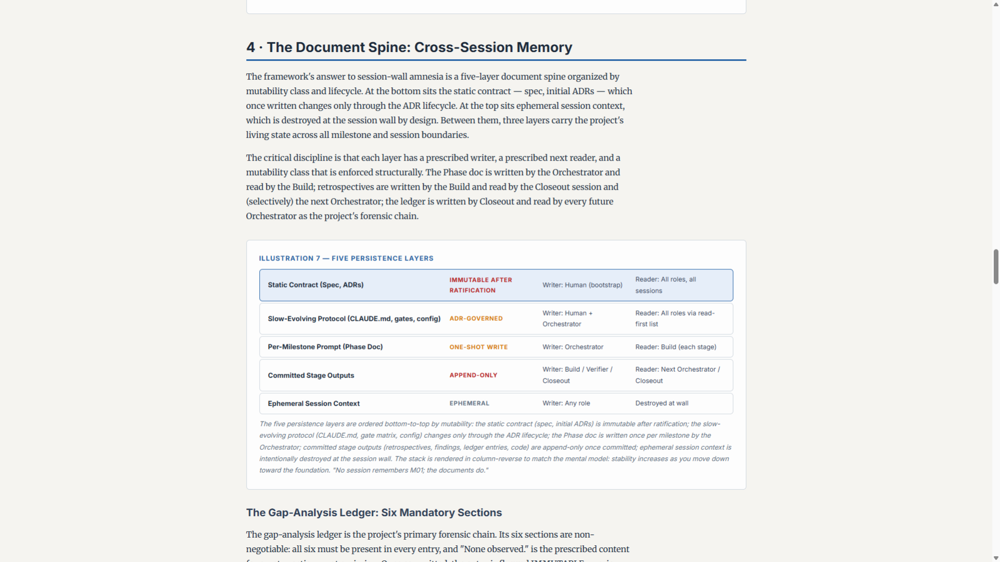
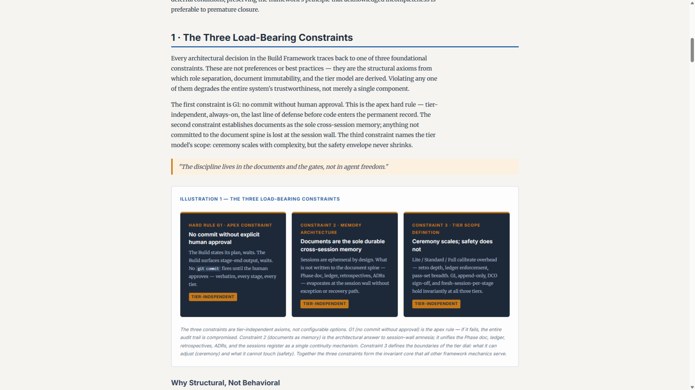

# MeetingSpace

A **desktop note-taking app for meetings**, with a Claude assistant built in. Capture everything during a meeting — typed notes, screenshots, and transcripts — and let Claude turn it into a polished white paper, structured minutes, or searchable notes.

Local-first and single-user: your data stays on **your** machine. Windows and macOS.

> **Status:** v1.1 — released. Free and open-source (MIT). Built with Claude.


---

## What it does

Create a **named space** for a meeting, then drop things in as it happens:

- **Typed notes** — autosaved as you go, no save button.
- **Screenshots** — drag-and-drop, paste from the clipboard (Ctrl/⌘+V), upload a file, or capture your screen from inside the app.
- **Transcripts** — paste or upload text.

Everything is saved to that space and stays fully searchable later. When you're ready, the built-in **Claude** layer turns a captured session into, on demand:

- a detailed **white paper**,
- structured **meeting minutes** (with your screenshots inline), or
- just your **raw notes**, organized and searchable.

There's also an in-app **chat** with Claude that's grounded in the current space's content — ask questions about what you captured without leaving the app. Generated documents can be **exported** to a self-contained HTML file (images embedded, opens in any browser, makes no network calls) or to **PDF**.

### What it isn't

- **Not** a live audio recorder or speech-to-text — transcripts come in as text you paste or upload.
- **Not** cloud sync or real-time collaboration — it's local-first and single-user.
- **Not** a mobile app.

---

## Example output

Generated documents are fully formatted — headings, styled tables, callout illustrations, your screenshots inline — and export to a self-contained HTML file or PDF:

| | |
|---|---|
|  |  |

---

## How the Claude features work (your API key)

The capture side — notes, screenshots, transcripts, search, autosave — works with **no key at all**. The Claude features (chat, white paper, minutes) call the **Anthropic API using your own key**.

- **What you need:** your own Anthropic API key (it looks like `sk-ant-…`). Create one at <https://console.anthropic.com>.
- **It's pay-per-use.** You're billed by Anthropic for what you use. **Set a spend limit** on your key — see [API key best practices](https://support.claude.com/en/articles/9767949-api-key-best-practices-keeping-your-keys-safe-and-secure).
- **Where it's stored:** encrypted by your operating system (Windows DPAPI / macOS Keychain) and used only inside the app's background process — it's **never written to disk or logs in plaintext, and never leaves your machine** except as the API request you trigger.
- **This is not a Claude.ai login.** It does **not** use a Claude Pro/Max web subscription — only a pay-per-use API key from the Anthropic Console.
- **Add it any time:** there's a field on the first-run welcome screen, and in **Settings**. The app picks available Claude models automatically.

> **Generating a document takes time — be patient.** A full white paper is built in stages and can take **10+ minutes** to finish. The app shows progress while it works; that's expected, so leave it running rather than assuming it stalled. (Chat replies stream back quickly; it's the long-form documents that take a while.)

> **Advanced:** if your organization runs an Anthropic-compatible gateway/proxy, you can point MeetingSpace at it (a base URL plus a bearer token) in Settings instead of using a direct Anthropic key.

---

## Download & run

> **Prebuilt downloads** for Windows and macOS are published on the [**Releases**](https://github.com/kknipe2k/meetingspace/releases) page. If no release is posted yet, use **Build from source** below — it's a couple of commands.

| Your system | Get it | First-run note |
|---|---|---|
| **Windows 10 / 11** | `MeetingSpace Setup <version>.exe` (installer) **or** the portable `.zip` (no install) | SmartScreen may warn → **More info → Run anyway** (one time) |
| **macOS** (Apple Silicon or Intel) | `MeetingSpace-<version>.dmg` **or** the `.zip` — pick the file matching your chip | Gatekeeper warns → **right-click the app → Open** (one time) |
| **Linux** | Build from source (not packaged) | — |

**Unsigned build.** These builds aren't code-signed (no paid certificates), so each OS shows a one-time warning the first time you run an unsigned app. That's expected — the steps above (and the install guides) get you past it in one click.

Step-by-step guides, including the first-run bypass and how to **completely uninstall** (app + data):

- **Windows →** [INSTALL-WINDOWS.md](INSTALL-WINDOWS.md)
- **macOS →** [INSTALL-MACOS.md](INSTALL-MACOS.md)

### Build from source (any OS)

You need [Node.js](https://nodejs.org) 18 or newer. On Windows you may need the Visual Studio Build Tools (C++ workload); on macOS, the Xcode Command Line Tools (`xcode-select --install`). Then:

```bash
git clone https://github.com/kknipe2k/meetingspace.git
cd meetingspace
npm install            # installs dependencies, prepares the native database module
npm run dev            # launch the app
```

To produce an installable build instead of running in dev:

```bash
npm run package:win    # Windows installer + portable zip  → release/
npm run package:mac    # macOS .dmg + .zip  (must run ON a Mac — can't cross-build)
```

The per-OS guides cover prerequisites and troubleshooting in detail.

---

## Your data & privacy

- **Everything is stored locally** on your device — the notes database, your screenshots, the encrypted API-key blob, and your settings. Nothing is uploaded anywhere.
- **No telemetry, no analytics, no "phone home."** The only outbound network request the app ever makes is the Claude API call you trigger with your own key.
- **Your API key is encrypted at rest** by the OS keychain and never stored or logged in plaintext.
- **Generated documents are isolated.** Content Claude generates is sanitized and rendered in a sandboxed frame; an exported HTML file carries a strict policy that prevents it from making any network request when you share it.
- **Back up any time:** Settings → *Back up all data* writes a single portable file you can restore later.

Where your data lives (and how to wipe it completely) is documented in the per-OS install guides.

---

## License & credits

- **License:** [MIT](LICENSE). Copyright © 2026 MeetingSpace Project Contributors.
- **AI assistance:** MeetingSpace was written almost entirely by AI (Anthropic's Claude), which also did the code review and testing. There was no line-by-line human code review; instead a human validated each release hands-on — running the app and confirming the AI's review and tests passed clean.
- **Fonts:** generated documents self-host **Inter** and **Merriweather**, both under the SIL Open Font License 1.1 — full attribution in [`assets/fonts/NOTICE.md`](assets/fonts/NOTICE.md).

*Shared as-is and not actively maintained — feel free to fork it. For security reports, see [SECURITY.md](SECURITY.md).*
