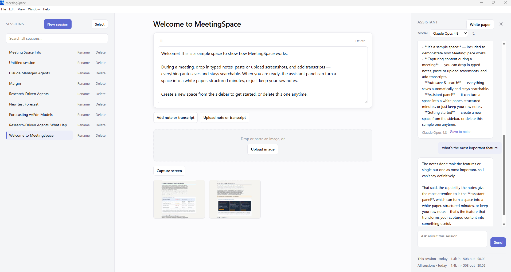

# MeetingSpace

A Windows-first (macOS-portable) **desktop note-taking app for meetings** — a graphical, OneNote-style workspace with a Claude-powered LLM layer built in. Local-first, single-user, your data stays on your machine.

> **Status:** **v1.1 — released** (Windows-first; macOS builds from source). Open-source under the MIT License. Built with Claude Code — see [AI assistance disclosure](#ai-assistance-disclosure).

<!-- TODO: add a screenshot or short demo GIF here — it's the first thing a new visitor looks for. -->
<!--  -->

---

## What it is

Create a **named space** for a meeting. During the meeting, drop in:

- **Typed notes** (autosaved)
- **Screenshots** — drag-drop, clipboard paste, file upload, or in-app screen capture
- **Transcripts** — paste or upload text

Everything saves to the named space and is fully retrievable later. A built-in **Claude layer** (using *your own* Anthropic API key) then turns a captured session into, on demand:

- a detailed **white paper**,
- structured **meeting minutes with screenshots**, or
- just the **raw notes**, saved and searchable.

There's also an in-app Claude **chat** grounded in the current session's content.

## What it isn't

- **Not** a live audio recorder / speech-to-text engine — transcripts come in as text (live STT is a v2 idea).
- **Not** real-time collaboration or cloud sync — it's local-first and single-user.
- **Not** a mobile app.
- It does **not** use a Claude.ai web-subscription login — it talks to the Anthropic API with **your API key**, stored encrypted in the OS keychain (never plaintext).

---

## Getting started

There are two ways in. **Most people want "Use it."**

### 🟢 Use it (build & run on your machine)

MeetingSpace ships as **source you build locally** — no paid code-signing certificates, nothing pre-built running on your machine that you didn't compile yourself. It takes ~15 minutes and a couple of commands. Follow the step-by-step guide for your OS:

- **Windows** → **[WINDOWS-PACKAGE-README.md](WINDOWS-PACKAGE-README.md)** (prerequisites → build → run → uninstall)
- **macOS** → **[MACOS-PACKAGE-README.md](MACOS-PACKAGE-README.md)** (prerequisites → build → run → uninstall)
- **Linux** — not packaged or tested. Advanced users can run it from source with `npm install && npm run dev` (it's Electron + better-sqlite3, so it should work, but there's no supported build or IRL validation yet).

> **You'll need your own Anthropic API key for the Claude features.** Notes, screenshots, transcripts, search, and persistence all work with **no key**. Chat / white-paper / minutes generation call the **Anthropic API with your key**, which is **pay-per-use** — create a key at <https://console.anthropic.com>, and **set a spend limit** ([key best practices](https://support.claude.com/en/articles/9767949-api-key-best-practices-keeping-your-keys-safe-and-secure)). Your key is stored encrypted by your OS (Windows DPAPI / macOS Keychain) and never leaves your machine in plaintext.

> **Unsigned build.** Because there are no paid certs, the first launch may show a one-time warning (Windows SmartScreen / macOS Gatekeeper). Each OS guide includes the exact one-click bypass — this is expected, nothing is wrong.

### 🛠️ Build from source / contribute

```bash
npm install        # installs deps + prepares better-sqlite3 for Electron's ABI
npm run dev        # launch the app in development
npm test           # unit/component tests
npm run e2e        # Playwright-on-Electron smoke
npm run build      # production build
npm run package:win  # Windows NSIS installer  → release/
npm run package:mac  # macOS .dmg + .zip (run ON A MAC — can't cross-build from Windows)
```

---

## Stack

| Layer | Choice |
|---|---|
| Desktop shell | **Electron** (Node main process owns all privileged work) |
| UI | **React + TypeScript + Vite** (sandboxed renderer) |
| Storage | **better-sqlite3** (metadata + retrieval) + filesystem blobs for screenshots, per session |
| LLM | official **`@anthropic-ai/sdk`**, called only from the main process |
| Secrets | Electron **`safeStorage`** (Windows DPAPI / macOS Keychain) |
| Screen capture | Electron **`desktopCapturer`** |

Security model: `contextIsolation: true`, `nodeIntegration: false`, sandboxed renderer; the renderer never sees the API key and reaches native work only over a typed IPC contract. An independent code/security audit was run before open-sourcing — see [`AUDIT-FINDINGS.md`](AUDIT-FINDINGS.md).

---

## What shipped (v1.1)

| Milestone | Goal |
|---|---|
| **M01** | App shell + storage foundation — three-zone shell; named sessions persist across close→reopen |
| **M02** | Live capture surface — notes, screenshots (all four paths), transcripts |
| **M03** | Claude integration + secure key — encrypted API key, in-app chat over session content |
| **M04** | Document generation + retrieval — white paper / minutes / raw notes + cross-session search |
| **M05** | Polish + cross-platform + packaging (v1 release) |
| **M07** | Generation robustness + providers — real cancel, watchdog, provider switch |
| **M06** | Desktop maturity + distribution — native menus, storage tools, backup/restore, onboarding (v1.1 release) |

**v2 backlog** (ideas, not committed): live audio transcription / STT, multi-space organization, rich-text note editing.

---

## Design

The UI follows a single design brief in **`docs/design.md`** — a light, spacious "Linear-in-daylight" system (one lavender accent, hairline borders, generous whitespace).

---

## AI assistance disclosure

MeetingSpace was implemented with substantial AI assistance (Anthropic's Claude, via Claude Code). All changes were human-reviewed before merge.

---

## Fonts

Generated documents (white paper / minutes) self-host two typefaces so the designed typography renders offline inside the sandboxed render frame (M04.C, ADR-0013):

- **Inter** — © The Inter Project Authors — SIL Open Font License 1.1
- **Merriweather** — © The Merriweather Project Authors — SIL Open Font License 1.1

License texts and full attribution: [`assets/fonts/NOTICE.md`](assets/fonts/NOTICE.md).

---

## Project status & contributing

Shared as-is and lightly maintained — there's no guaranteed review cadence, but contributions are welcome if you'd like to build on it.

- **Issues are disabled.** This is a personal project published for others to use and fork, not a supported product.
- **Want to extend it?** Fork and open a pull request with a DCO sign-off (`git commit -s`, asserting the [Developer Certificate of Origin](https://developercertificate.org/)). See [`CONTRIBUTING.md`](CONTRIBUTING.md) for setup, the quality gates, and the full workflow.
- **Security:** please don't open a public report — see [`SECURITY.md`](SECURITY.md). Use [GitHub Security Advisories](https://github.com/kknipe2k/meetingspace/security/advisories/new) (preferred) or email `ardenagentic+security@gmail.com` privately.

---

## License

MeetingSpace is released under the **MIT License** — see [`LICENSE`](LICENSE).
Copyright (c) 2026 MeetingSpace Project Contributors.
